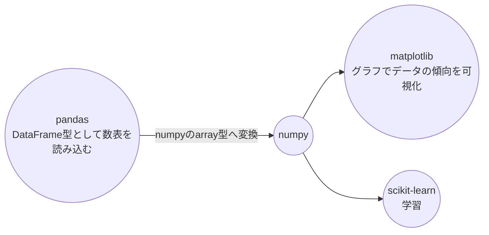

## 単回帰分析とは
単回帰は教師あり学習のひとつで, 1つの説明変数から目的変数を予測する手法です.  
回帰は目的変数が連続値である予測が出来た場合に用いられます.  

## 使用するライブラリ
- **pandas**  
  数表を扱うライブラリ.  
- **numpy**  
  行列計算をするためのライブラリ.  
- **scikit-learn**  
  学習のためのモデルやデータを扱うライブラリ.  
- **matplotlib**  
  グラフを作成するためのライブラリ.  

## 手順

