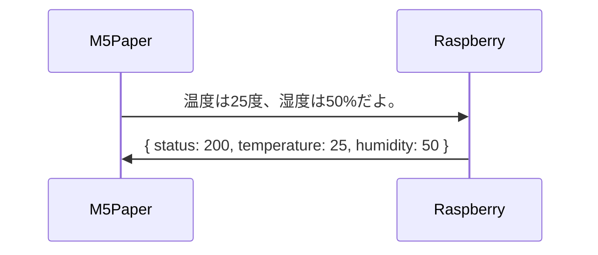

概要図をMermaid記法で記述する。

```mermaid,autorun
sequenceDiagram
  participant M5Paper
  participant Raspberry
  M5Paper->>Raspberry: 温度は25度、湿度は50%だよ。
  Raspberry->>M5Paper: { status: 200, temperature: 25, humidity: 50 }
```
